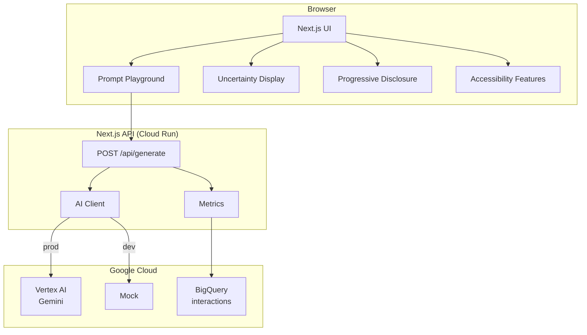
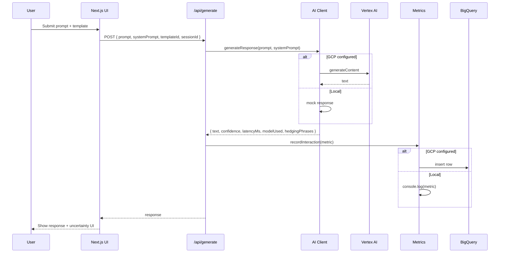

# AI UX Case Study

A **web app** that showcases thoughtful AI UX patterns: prompt engineering best practices, handling model uncertainty, progressive disclosure of AI capabilities, and accessibility-first AI interactions. Built to bridge UX/UI design with AI integration.

---

## Problem Statement

**Users struggle with AI interfaces that feel opaque, overconfident, or inaccessible.**

- **Opacity:** Many UIs treat the AI as a black box. Users don’t see how prompts affect output or what “good” prompts look like.
- **Overconfidence:** Models often answer without signaling uncertainty. Users can’t tell when to trust or verify.
- **Overwhelm:** Showing every AI feature at once increases cognitive load and hides the most useful flows.
- **Accessibility:** AI UIs are often keyboard-unfriendly, lack screen reader support, and ignore reduced-motion preferences.

This case study demonstrates **concrete patterns** to address these issues and documents the **decision-making** behind each choice.

---

## Architecture

### High-level flow



### Component responsibilities

| Component | Responsibility |
|-----------|----------------|
| **Prompt Playground** | Lets users pick prompt templates (role+context, few-shot, chain-of-thought, constraints) and send prompts. Demonstrates prompt engineering best practices. |
| **Uncertainty Display** | Shows confidence (derived from hedging detection), latency, model. Surfaces a banner when confidence is low or hedging phrases are detected. |
| **Progressive Disclosure** | Section tabs and expandable capability levels so users see one primary flow first and discover more over time. |
| **Accessibility** | Keyboard nav, visible focus, ARIA labels/live regions, `prefers-reduced-motion` and `prefers-contrast`. |
| **AI Client** | Abstracts Vertex AI; uses mock when GCP is not configured so the app runs locally without credentials. |
| **Metrics** | Records each interaction (latency, confidence, template, hedging) to BigQuery when GCP is set; otherwise logs to console. |

### Data flow (generate)



---

## Metrics

We track the following **per interaction** (when BigQuery is configured):

| Metric | Description | Use |
|--------|-------------|-----|
| **latency_ms** | Time from request to response | Performance, SLO |
| **confidence** | Heuristic (hedging-based) 0–1 | Accuracy proxy |
| **has_hedging** | Whether hedging phrases were detected | Uncertainty analysis |
| **prompt_length** / **response_length** | Character counts | Cost/token proxy |
| **model_used** | e.g. `gemini-1.5-flash` or `mock-local` | Cost and model comparison |
| **template_id** | Which prompt template was used | Prompt engineering impact |

### Example queries (BigQuery)

**Average latency by model:**

```sql
SELECT model_used, AVG(latency_ms) AS avg_latency_ms, COUNT(*) AS n
FROM `ai_ux_metrics.interactions`
GROUP BY model_used;
```

**Share of low-confidence responses:**

```sql
SELECT
  COUNTIF(confidence < 0.5) / COUNT(*) AS pct_low_confidence,
  COUNTIF(has_hedging) / COUNT(*) AS pct_with_hedging
FROM `ai_ux_metrics.interactions`;
```

### Target ranges (reference)

| Metric | Target | Notes |
|--------|--------|-------|
| **Latency (p95)** | < 3s | Vertex AI Gemini Flash; mock ~1–1.2s |
| **Confidence (avg)** | > 0.7 | Heuristic; improve with better prompts |
| **Cost** | Per Vertex AI pricing | Input/output tokens; monitor via BQ + billing |

See **[docs/METRICS.md](docs/METRICS.md)** for performance, accuracy (proxy), latency, and cost in more detail.

---

## Decision-Making

Design and implementation choices are documented in **[docs/DECISIONS.md](docs/DECISIONS.md)**, including:

- Mock-first AI client for local reproducibility
- Confidence and hedging heuristic (no native confidence from Vertex AI)
- Progressive disclosure via section tabs and expandable levels
- Accessibility-first (keyboard, focus, ARIA, reduced motion)
- BigQuery for metrics and Cloud Run for deployment

---

## Reproducibility: How to Run

### Prerequisites

- **Node.js 18+**
- (Optional) **Google Cloud project** with Vertex AI and BigQuery for production behavior

### Local run (no GCP)

1. Clone and install:

   ```bash
   git clone <repo>
   cd AI-UX-Case-Study
   npm install
   ```

2. Start the app:

   ```bash
   npm run dev
   ```

3. Open [http://localhost:3000](http://localhost:3000).  
   The app uses a **mock AI** and logs metrics to the console. No API keys required.

### Local run with GCP (Vertex AI + BigQuery)

1. Create a GCP project and enable **Vertex AI API** and **BigQuery API**.
2. Create a service account with roles: **Vertex AI User**, **BigQuery Data Editor** (for the dataset/table).
3. Create the BigQuery dataset and table (see [BigQuery setup](#bigquery-setup)).
4. Set environment variables (see [.env.example](.env.example)):

   ```bash
   cp .env.example .env
   # Edit .env: GOOGLE_CLOUD_PROJECT, GOOGLE_APPLICATION_CREDENTIALS, etc.
   ```

5. Run:

   ```bash
   npm run dev
   ```

   The app will call Vertex AI and write metrics to BigQuery.

---

## Deployment (Google Cloud Run)

### Build and run with Docker locally

```bash
npm run build
docker build -t ai-ux-case-study .
docker run -p 8080:8080 ai-ux-case-study
# Open http://localhost:8080
```

### Deploy to Cloud Run

**Option A: Cloud Build (recommended)**

1. Connect your repo to Cloud Build and set substitution `_PROJECT_ID`.
2. Use the provided [cloudbuild.yaml](cloudbuild.yaml):

   ```bash
   gcloud builds submit --config=cloudbuild.yaml
   ```

3. Cloud Build will build the image and deploy to Cloud Run. Set **env vars** in the Cloud Run service (same as [.env.example](.env.example)) for Vertex AI and BigQuery.

**Option B: Manual deploy**

```bash
export PROJECT_ID=your-gcp-project
gcloud builds submit --tag gcr.io/$PROJECT_ID/ai-ux-case-study
gcloud run deploy ai-ux-case-study \
  --image gcr.io/$PROJECT_ID/ai-ux-case-study \
  --region us-central1 \
  --platform managed \
  --allow-unauthenticated
```

Then configure environment variables in the Cloud Run console for `GOOGLE_CLOUD_PROJECT`, `GOOGLE_APPLICATION_CREDENTIALS` (or use Workload Identity), `BIGQUERY_DATASET`, `BIGQUERY_TABLE`, etc.

### BigQuery setup

1. Create dataset (e.g. `ai_ux_metrics`) in the BigQuery console or:

   ```bash
   bq mk --dataset $GOOGLE_CLOUD_PROJECT:ai_ux_metrics
   ```

2. Create the table using [scripts/create_bigquery_table.sql](scripts/create_bigquery_table.sql) (run in BigQuery Console with Standard SQL, or adapt for `bq query`).

3. Ensure the Cloud Run service account (or the one in `GOOGLE_APPLICATION_CREDENTIALS`) has **BigQuery Data Editor** on that dataset/table.

---

## Project layout

```
AI-UX-Case-Study/
├── README.md                 # This file
├── docs/
│   └── DECISIONS.md          # Decision log
├── app/
│   ├── api/generate/route.ts # POST /api/generate
│   ├── globals.css
│   ├── layout.tsx
│   └── page.tsx              # Main UI (tabs + sections)
├── components/
│   ├── PromptPlayground.tsx   # Prompt templates + input
│   ├── UncertaintyDisplay.tsx# Confidence, hedging, latency
│   ├── ProgressiveDisclosure.tsx
│   └── AccessibilityFeatures.tsx
├── lib/
│   ├── ai-client.ts          # Vertex AI + mock
│   ├── metrics.ts            # BigQuery + console fallback
│   └── utils.ts
├── scripts/
│   └── create_bigquery_table.sql
├── Dockerfile
├── cloudbuild.yaml
├── .env.example
├── next.config.js
├── package.json
└── tailwind.config.ts
```

---

## Tech stack

- **Next.js 14** (App Router), **React 18**, **TypeScript**
- **Tailwind CSS**, **Framer Motion**
- **Vertex AI** (`@google-cloud/vertexai`) for Gemini
- **BigQuery** (`@google-cloud/bigquery`) for metrics
- **Cloud Run** for deployment (Docker + optional Cloud Build)

---

## License

MIT.
